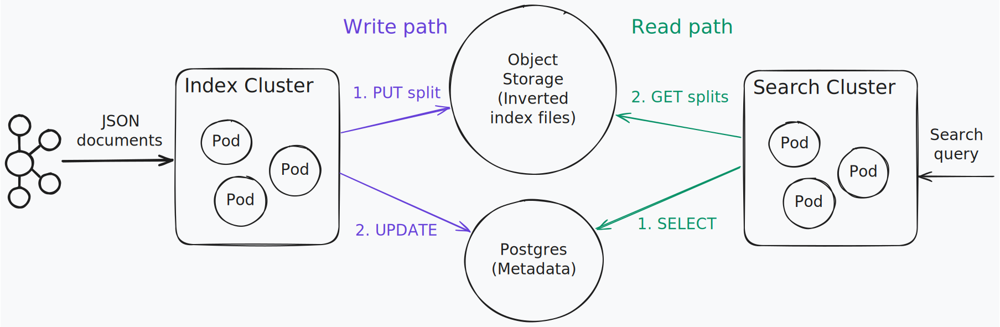

## Introduction

`toshokan` is a search engine (think Elasticsearch, Splunk), but storing the data on object storage, most similar to <a href="https://github.com/quickwit-oss/quickwit">Quickwit</a>.

It uses:
* <a href="https://github.com/quickwit-oss/tantivy">tantivy</a> - for building and searching the inverted index data structure.
* <a href="https://github.com/apache/opendal">Apache OpenDAL</a> - for an abstraction over object storages.
* <a href="https://www.postgresql.org/">PostgreSQL</a> - for storing metadata atomically, removing data races.

I've also posted a <a href="https://tontinton.com/posts/new-age-data-intensive-apps/">blog post</a> explaining the benefits and drawbacks of using an object storage for data intensive applications.

## Architecture

<kbd style="background-color: #1e1e1e">
  
</kbd>

## How to use

```sh
toshokan create example_config.yaml

# Index a json file delimited by new lines.
toshokan index test ~/hdfs-logs-multitenants-10000.json

# Index json records from kafka.
# Every --commit-interval, whatever was read from the source is written to a new index file.
toshokan index test kafka://localhost:9092/topic --stream

toshokan search test "tenant_id:[60 TO 65} AND severity_text:INFO" --limit 1 | jq .
# {
#   "attributes": {
#     "class": "org.apache.hadoop.hdfs.server.datanode.DataNode.clienttrace"
#   },
#   "body": "src: /10.10.34.30:33078, dest: /10.10.34.11:50010, bytes: 234, op: HDFS_WRITE, cliID: DFSClient_NONMAPREDUCE_-202827006_103, offset: 0, srvID: d9ef1b17-4314-4cd8-91eb-095413c3427f, blockid: BP-108841162-10.10.34.11-1440074360971:blk_1074072709_331885, duration: 2571934",
#   "resource": {
#     "service": "datanode/01"
#   },
#   "severity_text": "INFO",
#   "tenant_id": 61,
#   "timestamp": "2016-04-13T06:46:54Z"
# }

# Merge index files for faster searching.
toshokan merge test

toshokan drop test
```
